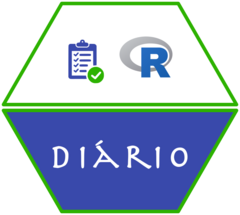

<!-- README.md is generated from README.Rmd. Please edit that file -->

```{r, include = FALSE}
knitr::opts_chunk$set(
  collapse = TRUE,
  comment = "#>",
  fig.path = "man/figures/README-",
  out.width = "100%"
)
```

# diario 

<!-- badges: start -->
<!-- badges: end -->

**diario** provides a set of functions for securely storing API tokens and interacting with the **diariodeobras.net** system. It wraps common functionality (e.g., authentication, GET/POST requests) in convenient R functions, making it easier to integrate **Diario** within R workflows.

## Installation

You can install the development version of `diario` from [GitHub](https://github.com/StrategicProjects/diario) with:

```r
# install.packages("remotes")   # if needed
remotes::install_github("StrategicProjects/diario")
```

## Getting Started

1.	Store your API token: 

Before making any requests, you’ll need to store your Diario API token securely. Use `diario_store_token()`:

```r
library(diario)

# Store your API token securely using keyring
diario_store_token("YOUR_API_TOKEN_HERE")
```

2.	Retrieve your token (for debugging or confirmation):
	
```r
diario_retrieve_token()
#> "YOUR_API_TOKEN_HERE"
```
3.	Make an authenticated request:

The main workhorse is `perform_request()`, which sets up and executes an authenticated request to the Diario API endpoints.

```r
# Example: retrieving data from an endpoint
response <- diario_perform_request("v1/obras")
head(response)
```

## Usage Examples

### Get Company Details

```r
# Retrieve information about the company
company_info <- diario_get_company()
company_info
```

### Get Registered Entities

```r
entities <- diario_get_entities()
entities
```

### Get List of Projects (Obras)

```r
projects <- diario_get_projects()
projects
```

### Get Project Details

```r
project_id <- "6717f864d163f517ae06e242"
project_details <- diario_get_project_details(project_id)
project_details
```

### Get Task List for a Project

```r
tasks <- diario_get_task_list(project_id)
tasks
```
### Get Task Details

```r
task_id <- "6717f884baf8d51c4f079593"
task_details <- diario_get_task_details(project_id, task_id)
task_details
```

### Get Reports for a Project

```r
reports <- diario_get_reports(project_id, limit = 10, order = "asc")
reports
```

### Get Report Details

```r
report_id <- "67648080f0971de9d00324c2"
report_details <- diario_get_report_details(project_id, report_id)
report_details
```

## Contributing

If you would like to contribute to `diario`:

-	Submit issues or feature requests in the [GitHub repository](https://github.com/StrategicProjects/diario).
-	Create a pull request with your changes or improvements.

## License

This package is provided under the [MIT License](LICENSE). See LICENSE for details.
